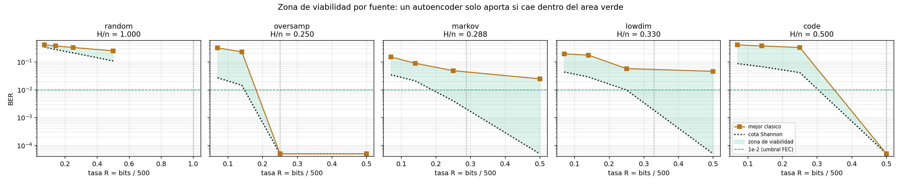

# Resultados

Todo lo de esta página está validado: el arnés pasa una prueba de calibración
con respuesta conocida, y los resultados de autoencoder se reportan sobre
**cuatro semillas independientes** que varían tanto la instancia de la fuente
como la inicialización del modelo.

---

## La respuesta

**Los autoencoders no son viables para comprimir flujos de bits BPSK** a las
tasas estudiadas. Con el umbral absoluto de telecomunicaciones —un BER previo a
la decodificación de 10⁻², corregible con LDPC o turbo— **18 de 20 puntos de
operación no lo alcanzan**.

| categoría | criterio | puntos |
|---|---|---|
| Buena sin FEC | BER < 10⁻³ | 2/20 |
| Usable con FEC | BER < 10⁻² | 2/20 |
| Marginal | BER < 10⁻¹ | 7/20 |
| Inservible | BER ≥ 10⁻¹ | 13/20 |

Los dos que pasan son `oversamp` a 125 y 250 bits, donde un *sample-and-hold* de
tres líneas consigue lo mismo. El mejor resultado sobre estructura no trivial es
`markov` a 250 bits: BER 0.0344, es decir **17 bits errados de cada 500**,
equivalente a un enlace BPSK sin codificar a 2.2 dB.

---

## Pero hay una franja donde sí superan a lo clásico

Seis configuraciones ganan al mejor método clásico en **4 de 4 semillas**:

| fuente | modo | L | AE | vara | margen | significancia |
|---|---|---|---|---|---|---|
| lowdim | direct | 70 | 0.1051 ± 0.0004 | 0.1861 | +0.0810 | 216 σ |
| lowdim | nested | 70 | 0.1241 ± 0.0005 | 0.1861 | +0.0620 | 123 σ |
| markov | direct | 35 | 0.1498 ± 0.0003 | 0.1531 | +0.0033 | 10 σ |
| lowdim | direct | 35 | 0.1870 ± 0.0010 | 0.1954 | +0.0084 | 9 σ |
| markov | nested | 35 | 0.1485 ± 0.0006 | 0.1531 | +0.0046 | 8 σ |
| markov | direct | 70 | 0.0902 ± 0.0003 | 0.0914 | +0.0012 | 4 σ |

Dos condiciones, ambas necesarias: **tasas agresivas** (R ≤ 0.14) y **estructura
geométrica o correlacional**. En R ≥ 0.25 el autoencoder no gana en ninguna
fuente. La frontera está en R ≈ 0.25, donde `lowdim` gana 3/4 semillas por
+0.0005 y `markov` pierde 0/4.

La tensión que define el proyecto: **el autoencoder gana justo en el régimen
donde ningún método alcanza calidad de enlace.** Superar a PCA por un 43 % no
importa si ambos están dos órdenes de magnitud por encima del mínimo operativo.

### Control negativo

`random nested` L=250 gana en 1 de 4 semillas, con la varianza más alta de toda
la tabla (0.2453 a 0.2611, sd 0.0066). Es ruido oscilando alrededor de la vara,
que es exactamente lo que debe ocurrir sobre datos incompresibles. Una victoria
consistente ahí habría invalidado el experimento.

---

## La arquitectura debe coincidir con el tipo de estructura

Un encoder convolucional 1D frente al MLP, con la localidad como variable:

| fuente | localidad | efecto de la convolución |
|---|---|---|
| oversamp | sí (período 4) | **+10.3 %** |
| markov | sí (correlación local) | +3.5 % |
| code | no (P aleatoria) | +2.4 % |
| lowdim | no (W aleatoria) | **−21.4 %** |

La convolución ayuda donde hay estructura local y **estorba** donde la
estructura es global: sin localidad que explotar, pierde la capacidad de mezcla
global del MLP sin ganar nada a cambio. La confirmación en las dos direcciones
es lo que hace sólido el resultado.

Aporta una **victoria adicional**: `oversamp` L=70 con convolución da 0.2271
frente a una vara de 0.2330, un punto que el MLP perdía.

---

## El resultado negativo sobre redundancia algebraica

Sobre `code` —código de bloque con checks de grado 3— el autoencoder fracasa en
los cuatro escalones y en todas las semillas.

| estrategia | BER a L=250 |
|---|---|
| copiar 250 bits, adivinar el resto | 0.2500 |
| **autoencoder observado** | **0.1982** |
| oráculo que conoce la matriz de paridad | 0.0000 |

El autoencoder recorre solo el **21 %** del camino entre la estrategia trivial y
el óptimo. Medido contra su propia cota queda **más lejos del óptimo en `code`
(+0.198) que sobre ruido puro (+0.148)**.

Tres evidencias convergentes:

1. **PCA es igualmente ciego.** Sobre 10 semillas, su BER en `code` y en
   `random` son indistinguibles dentro de 1σ en los cuatro escalones.
2. **Un FEC de decisión blanda no ayudaría.** El cociente BER/BER-top90 es
   1.0–1.2× sobre `code`, frente a 3.9× sobre `markov`: los errores están
   repartidos uniformemente, no concentrados en bits de baja confianza.
3. **La redundancia es explotable.** El oráculo alcanza BER exactamente 0 con la
   mitad de los bits.

### La explicación, corregida

La hipótesis inicial era que el descenso de gradiente no aprende XOR de grado
alto. **El diagnóstico la refutó:** con 500 bits de entrada y grado 3, un MLP
alcanza acc_test = 1.0000. Solo falla en grado 4 (acc_test 0.4995, con acc_train
1.0 — memoriza sin generalizar), y la fuente usa grado 3.

La diferencia entre el diagnóstico y el autoencoder es la **supervisión**. El
diagnóstico recibe una etiqueta que *es* la paridad, y el gradiente apunta
directamente a ella. El autoencoder solo tiene pérdida de reconstrucción, y debe
descubrir 250 funciones de paridad simultáneas como subproducto de comprimir.

**El obstáculo es el objetivo, no la capacidad ni la aprendibilidad.** Es una
conclusión más débil que la original pero mejor sustentada, y deja una vía
concreta de trabajo futuro: un objetivo auxiliar que supervise la estructura.

---

## Hallazgos metodológicos

Probablemente lo más transferible del proyecto.

### Inestabilidad de escala en latentes binarios

Con `sign()` en el paso hacia adelante, escalar las preactivaciones no cambia la
salida: **la pérdida es ciega a la escala**. Pero el paso hacia atrás no lo es.
Existe una dirección degenerada por la que los pesos crecen sin penalización
mientras van anulando su propio gradiente.

Observado: el modelo alcanza BER 0.0003 y noventa épocas después está en 0.4725
con el 47 % de los bits muertos. Confirmado por medición — `pre_max` final
correlaciona monótonamente con el BER final:

| normalización | pre_max | BER final |
|---|---|---|
| BatchNorm sin afín | **3.8** | **0.0000** |
| LayerNorm sin afín | 13.3 | 0.0640 |
| tanh | 16.9 | 0.1706 |
| LayerNorm con afín | 28.6 | 0.1167 |

`BatchNorm1d(affine=False)` lo controla porque normaliza **por dimensión sobre
el batch**, aplicando realimentación negativa a cada bit por separado. LayerNorm
normaliza cada muestra contra sus propias dimensiones y no controla ninguna en
particular. Aun así, **1 de 4 semillas divergió**: la selección de checkpoint
por validación es necesaria, no opcional.

### La redundancia del latente es capacidad excedente

Medida con un modelo autoregresivo (entropía cruzada de test como cota superior,
verificada contra la cota de Fano):

| fuente | L | L / H_fuente | redundancia |
|---|---|---|---|
| oversamp | 250 | 2.00 | 36.1 % |
| markov | 250 | 1.74 | 33.8 % |
| markov | 70 | 0.49 | 16.3 % |
| lowdim | 70 | 0.42 | 3.6 % |
| lowdim | 35 | 0.21 | **1.0 %** |

Relación monótona: cuando sobran bits, el autoencoder los desperdicia; cuando
faltan, el latente sale casi incompresible. **A tasas bajas —donde el
autoencoder gana— no hay nada que ganar por codificación entrópica.**

Excepción informativa: `markov` L=70 tiene 16.3 % frente al 3.6 % de `lowdim`
L=70, con menos capacidad relativa. El autoencoder codifica estructura
geométrica más eficientemente que correlacional.

### Modos de entrenamiento

Anidar sale **esencialmente gratis** (costo mediano +0.0011 BER) y produce un
códec compatible en tasa: un modelo con cuatro puntos de operación. El
preentrenamiento voraz por capas (`stacked`) es **consistentemente el peor y el
menos reproducible** (|Δ| máxima entre semillas de 0.079 frente a 0.010 en los
otros modos).

### Los datos están saturados

Con **pasos fijos** (30 000 en todas las corridas, para no confundir el efecto
de los datos con el de la optimización):

| n_train | BER |
|---|---|
| 200k | 0.1106 |
| 400k | 0.1053 |
| 800k | 0.1056 |
| 1.6M | 0.1040 |

Plano desde 400k. Un análisis previo con épocas fijas sugería una mejora del
14.5 % al duplicar los datos; con pasos fijos se ve que venía de **más
actualizaciones**, no de más diversidad.

---

## Resultados clásicos verificados

Independientes del arnés de autoencoders: NumPy puro, semillas fijas,
regenerables en segundos con `python3 code/generar_tablas.py`.

### Cotas teóricas

| Fuente | H (bits) | H/n | L=35 | L=70 | L=125 | L=250 |
|---|---|---|---|---|---|---|
| `random` | 500.0 | 1.000 | 0.3455 | 0.2834 | 0.2145 | 0.1100 |
| `code` | 250.0 | 0.500 | 0.0881 | 0.0684 | 0.0417 | **0** |
| `lowdim` | 164.9 | 0.330 | 0.0439 | 0.0291 | 0.0099 | **0** |
| `markov` | 143.9 | 0.288 | 0.0348 | 0.0211 | 0.0040 | **0** |
| `oversamp` | 125.0 | 0.250 | 0.0272 | 0.0146 | **0** | **0** |

### PCA es ciego a la redundancia algebraica

Sobre **10 semillas**, media ± desviación estándar:

| Latente | `code` | `random` | diferencia |
|---|---|---|---|
| 35 bits | 0.4160 ± 0.0006 | 0.4161 ± 0.0005 | −0.0000 ± 0.0008 |
| 70 bits | 0.3795 ± 0.0004 | 0.3794 ± 0.0006 | +0.0001 ± 0.0008 |
| 125 bits | 0.3350 ± 0.0004 | 0.3352 ± 0.0006 | −0.0003 ± 0.0007 |
| 250 bits | 0.2526 ± 0.0004 | 0.2530 ± 0.0005 | −0.0003 ± 0.0006 |

Dentro de 1σ en los cuatro escalones. Datos en
[`data/pca_code_vs_random.csv`](../data/pca_code_vs_random.csv), procedencia en
[`data/procedencia.json`](../data/procedencia.json).

---

## Cuestiones de medición que cambiaron conclusiones

| Corrección | Por qué importaba |
|---|---|
| Latente binario con straight-through | Un latente `float32` de 50 dimensiones ocupa 1600 bits: reportar "compresión 10×" habría sido falso |
| Entropía de `lowdim` por conteo de Cover | Usar la dimensión del manifold (32) en lugar de 164.9 habría puesto la cota en el lugar equivocado |
| Decimación con *hold* además de vecino | Sobre `oversamp` a 125 bits, hold da 0.0000 y vecino 0.1241: usar solo vecino subestimaba la vara |
| Modo fijo al promediar semillas | Elegir el mejor modo por semilla es selección posterior: infló una victoria inexistente |
| Pasos fijos al escalar datos | Con épocas fijas, más datos son también más actualizaciones |
| Cota de Fano como verificación | Detectó que el primer estimador de entropía daba resultados imposibles |
| Control de monotonía | Más bits siempre debe dar menos BER; las violaciones delatan divergencia |

La decimación **no es monótona en la tasa** sobre `oversamp`: m=4 (tasa 0.250)
da BER 0 y m=3 (tasa 0.334) da 0.083, porque m=4 se alinea con el período de
repetición. Un detalle a reportar si se usa decimación como vara.
