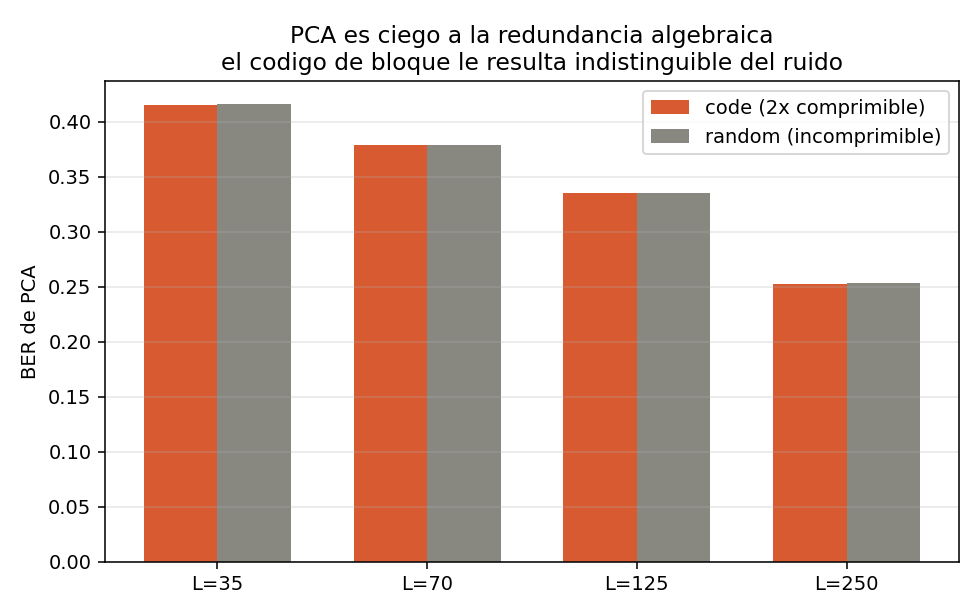

# Autoencoders para compresión de señales BPSK

Bitácora personal de trabajo. Registro de experimentos, decisiones, errores
encontrados y correcciones aplicadas, para poder retomar el hilo sin releer
todo desde cero.

**Pregunta.** ¿Puede un autoencoder comprimir un vector de 500 símbolos BPSK
(±1) y reconstruirlo con fidelidad suficiente para ser útil en un enlace real?

---

## Empieza por aquí

Si vengo a retomar esto después de un tiempo:

1. **[Bitácora](docs/00-bitacora.html)** — el camino completo, etapa por etapa:
   qué creíamos, qué lo rompió, qué cambiamos. Es la página que reconstruye todo
   el razonamiento.
2. **[Glosario](docs/06-glosario.html)** — cada término, con la definición que se
   usa aquí. Incluye la mecánica de ejecución (shards, gate test, JSONL).
3. **[Resultados](docs/03-resultados.html)** — qué está firme y qué no.

Referencia: [Teoría](docs/01-teoria.html) ·
[Metodología](docs/02-metodologia.html) ·
[Bibliografía](docs/04-bibliografia.html) ·
[Reproducir](docs/05-reproducir.html) ·
[Hacia un paper](docs/07-hacia-paper.html)

---

## Estado actual

| Componente | Estado |
|---|---|
| Cotas teóricas (Shannon) | Firme |
| Baselines clásicos | Firme |
| PCA es ciego a la redundancia algebraica | Firme |
| Barrido de autoencoders | **Firme** (4 semillas, calibración aprobada) |
| Escalera anidada | Firme (costo mediano +0.0011 BER) |
| Encoder convolucional | Firme (2 escalones, 1 semilla) |
| Diagnóstico de paridad | Ejecutado — **refutó** la hipótesis inicial |

**Proyecto cerrado.** La respuesta corta: los autoencoders **no** son viables
para comprimir flujos de bits BPSK — 18 de 20 puntos de operación quedan por
encima del umbral corregible por FEC. Pero **sí** superan a los métodos clásicos
a tasas agresivas (R ≤ 0.14) sobre estructura geométrica o correlacional, con
márgenes de 4σ a 216σ. Sobre redundancia algebraica fracasan, y el diagnóstico
mostró que el obstáculo no es la capacidad del modelo sino el objetivo de
reconstrucción.

---

## Las tres ideas que hay que tener claras

### 1. Un BER suelto no significa nada

Con latente de 500 bits el autoencoder aprende la identidad y da BER 0 sin
comprimir nada. La afirmación de viabilidad es siempre un par **(tasa, BER)**
contra una referencia.

### 2. Hacen falta dos referencias

**El piso** es la cota de Shannon: el BER mínimo físicamente alcanzable a esa
tasa. Nadie baja de ahí; violarla significa tener un bug.

**La vara** es el mejor método clásico con **el mismo número de bits**. Si el
autoencoder no le gana a PCA, no aporta nada: PCA es más rápido, determinista y
no necesita GPU.

Entre ambas está la **zona de viabilidad**.


### 3. La compresibilidad es de la señal, no del autoencoder

Por eso hay cinco fuentes y no una:

| Fuente | Estructura | H (bits) | Compresión máxima |
|---|---|---|---|
| `random` | ninguna | 500.0 | 1.00× |
| `code` | algebraica (XOR de grado 3) | 250.0 | 2.00× |
| `lowdim` | geométrica (manifold dim 32) | 164.9 | 3.03× |
| `markov` | correlacional (p = 0.05) | 143.9 | 3.47× |
| `oversamp` | repetición (×4) | 125.0 | 4.00× |

---

## Hallazgo firme: PCA es ciego a la redundancia algebraica

La fuente `code` es 2× comprimible **sin pérdida** — un oráculo que conoce la
matriz de paridad lo demuestra alcanzando BER exactamente 0 con la mitad de los
bits. PCA no detecta nada de esa estructura: su BER es indistinguible del que
obtiene sobre ruido puro.

Sobre 10 semillas independientes (media ± desviación estándar):

| Latente | `code` | `random` | diferencia |
|---|---|---|---|
| 35 bits | 0.4160 ± 0.0006 | 0.4161 ± 0.0005 | −0.0000 ± 0.0008 |
| 70 bits | 0.3795 ± 0.0004 | 0.3794 ± 0.0006 | +0.0001 ± 0.0008 |
| 125 bits | 0.3350 ± 0.0004 | 0.3352 ± 0.0006 | −0.0003 ± 0.0007 |
| 250 bits | 0.2526 ± 0.0004 | 0.2530 ± 0.0005 | −0.0003 ± 0.0006 |

La diferencia cae dentro de 1 sigma en los cuatro escalones.



La redundancia de un código de bloque vive en operaciones XOR de grado 3 sobre
GF(2), y PCA es una estadística de segundo orden. La hipótesis abierta del
proyecto es que **el descenso de gradiente comparte esa ceguera**, lo que
tendría consecuencias directas para aplicar autoencoders sobre señales ya
codificadas de canal.

---

## Reproducir

```bash
pip install -r requirements.txt
python3 code/generar_tablas.py     # sin GPU, segundos
```

Los resultados firmes se regeneran con NumPy y semillas fijas, sin redes
neuronales. Detalle y nivel con GPU en [Reproducir](docs/05-reproducir.html).
